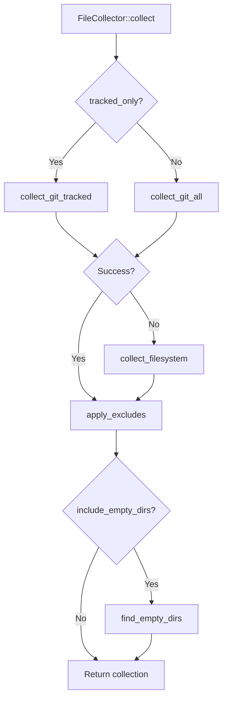

# Design Document: `--no-gitignore` Flag

## Overview

This document describes the design for adding a `--no-gitignore` CLI flag to the packager tool. This flag allows users to disable gitignore semantics when collecting files for packaging.

## Current Architecture

### File Collection Flow



### Current Gitignore Integration Points

The codebase currently honors gitignore in three locations:

1. **[`collect_git_all()`](../src/collector.rs:145)** - Uses `git ls-files -co --exclude-standard -z`
   - The `--exclude-standard` flag makes git filter out files matching gitignore patterns

2. **[`build_walker()`](../src/collector.rs:206)** - Filesystem fallback walker
   - Sets `.ignore(true)`, `.git_global(true)`, `.git_exclude(true)`, `.git_ignore(true)`

3. **[`find_empty_dirs()`](../src/collector.rs:230)** - Empty directory detection
   - Uses the same walker settings as `build_walker()`

### Key Structures

#### [`FileCollector`](../src/collector.rs:55)

```rust
pub struct FileCollector {
    root: PathBuf,
    tracked_only: bool,
    recurse_submodules: bool,
    exclude_matcher: ExcludeMatcher,
    include_empty_dirs: bool,
}
```

#### [`Args`](../src/config.rs:62)

```rust
pub struct Args {
    pub zip: Option<PathBuf>,
    pub output_dir: Option<PathBuf>,
    pub exclude: Vec<String>,
    pub tracked_only: bool,
    pub list_only: bool,
    pub no_packages: bool,
    pub ignore_package: Vec<String>,
    pub no_empty_dirs: bool,
    pub deterministic: bool,
    pub compression: CompressionLevel,
    pub checksum: bool,
    pub recurse_submodules: bool,
    pub quiet: bool,
    pub verbose: bool,
    pub root: PathBuf,
}
```

#### [`Config`](../src/config.rs:148)

```rust
pub struct Config {
    pub zip_path: PathBuf,
    pub root: PathBuf,
    pub excludes: Vec<String>,
    pub tracked_only: bool,
    pub list_only: bool,
    pub no_empty_dirs: bool,
    pub deterministic: bool,
    pub compression: CompressionLevel,
    pub checksum: bool,
    pub recurse_submodules: bool,
    pub quiet: bool,
    pub verbose: bool,
}
```

---

## Proposed Changes

### 1. Add CLI Flag to [`Args`](../src/config.rs:62)

**File:** `src/config.rs`

Add a new boolean flag after the `recurse_submodules` field:

```rust
/// Disable gitignore semantics - include all files
#[arg(long)]
pub no_gitignore: bool,
```

**Rationale:**
- Uses `--no-` prefix to indicate disabling a default behavior
- Consistent with existing `--no-empty-dirs` and `--no-packages` flags
- No short flag to avoid cluttering the CLI interface

### 2. Add Field to [`Config`](../src/config.rs:148)

**File:** `src/config.rs`

Add the field to the merged configuration:

```rust
pub struct Config {
    // ... existing fields ...
    pub no_gitignore: bool,
}
```

Update [`load_config()`](../src/config.rs:194) to pass through the value:

```rust
Ok(Config {
    // ... existing fields ...
    no_gitignore: self.no_gitignore,
})
```

### 3. Update [`FileCollector`](../src/collector.rs:55)

**File:** `src/collector.rs`

Add a new field to the struct:

```rust
pub struct FileCollector {
    root: PathBuf,
    tracked_only: bool,
    recurse_submodules: bool,
    exclude_matcher: ExcludeMatcher,
    include_empty_dirs: bool,
    no_gitignore: bool,  // NEW
}
```

Update the constructor:

```rust
pub fn new(
    root: PathBuf,
    tracked_only: bool,
    recurse_submodules: bool,
    exclude_matcher: ExcludeMatcher,
    include_empty_dirs: bool,
    no_gitignore: bool,  // NEW
) -> Self {
    Self {
        root,
        tracked_only,
        recurse_submodules,
        exclude_matcher,
        include_empty_dirs,
        no_gitignore,
    }
}
```

### 4. Modify [`collect_git_all()`](../src/collector.rs:145)

**File:** `src/collector.rs`

Conditionally include `--exclude-standard` based on `no_gitignore`:

```rust
fn collect_git_all(&self) -> Result<FileCollection> {
    let mut args = vec!["ls-files", "-co", "-z"];
    
    // Only use --exclude-standard if no_gitignore is false
    if !self.no_gitignore {
        args.push("--exclude-standard");
    }
    
    if self.recurse_submodules {
        args.push("--recurse-submodules");
    }

    // ... rest unchanged
}
```

**Behavior Change:**
- When `no_gitignore = false` (default): `git ls-files -co --exclude-standard -z` - filters ignored files
- When `no_gitignore = true`: `git ls-files -co -z` - includes all files, ignored or not

### 5. Modify [`build_walker()`](../src/collector.rs:206)

**File:** `src/collector.rs`

Conditionally set gitignore-related options:

```rust
fn build_walker(&self) -> Walk {
    let mut builder = WalkBuilder::new(&self.root)
        .hidden(false)
        .follow_links(false)
        .same_file_system(true);
    
    // Only apply gitignore semantics if no_gitignore is false
    if !self.no_gitignore {
        builder
            .ignore(true)
            .git_global(true)
            .git_exclude(true)
            .git_ignore(true);
    }
    
    builder.build()
}
```

### 6. Modify [`find_empty_dirs()`](../src/collector.rs:230)

**File:** `src/collector.rs`

Apply the same conditional logic to the walker used for finding empty directories:

```rust
fn find_empty_dirs(&self, collection: &mut FileCollection) -> Result<()> {
    // ... existing code for dirs_with_files ...

    // Build walker with conditional gitignore
    let mut builder = WalkBuilder::new(&self.root)
        .hidden(false)
        .follow_links(false);
    
    if !self.no_gitignore {
        builder
            .ignore(true)
            .git_global(true)
            .git_exclude(true)
            .git_ignore(true);
    }
    
    let walker = builder.build();

    // ... rest unchanged
}
```

### 7. Update [`main.rs`](../src/main.rs:93)

**File:** `src/main.rs`

Pass the new parameter to `FileCollector::new()`:

```rust
let collector = FileCollector::new(
    config.root.clone(),
    config.tracked_only,
    config.recurse_submodules,
    exclude_matcher,
    !config.no_empty_dirs,
    config.no_gitignore,  // NEW
);
```

Also add verbose logging for the new flag:

```rust
console.verbose(&format!("No gitignore: {}", config.no_gitignore));
```

---

## Implementation Summary

| File | Change Type | Description |
|------|-------------|-------------|
| `src/config.rs` | Add field | `no_gitignore: bool` to `Args` struct |
| `src/config.rs` | Add field | `no_gitignore: bool` to `Config` struct |
| `src/config.rs` | Modify | `load_config()` to pass through `no_gitignore` |
| `src/collector.rs` | Add field | `no_gitignore: bool` to `FileCollector` struct |
| `src/collector.rs` | Modify | `new()` constructor to accept `no_gitignore` |
| `src/collector.rs` | Modify | `collect_git_all()` to conditionally use `--exclude-standard` |
| `src/collector.rs` | Modify | `build_walker()` to conditionally apply gitignore settings |
| `src/collector.rs` | Modify | `find_empty_dirs()` to conditionally apply gitignore settings |
| `src/main.rs` | Modify | Pass `no_gitignore` to `FileCollector::new()` |
| `src/main.rs` | Modify | Add verbose logging for `no_gitignore` |

---

## Edge Cases and Considerations

### 1. Interaction with `--tracked-only`

When `--tracked-only` is used, the `collect_git_tracked()` method is called instead of `collect_git_all()`. This method uses `git ls-files -z` without `--exclude-standard`, so it only returns tracked files regardless of gitignore status.

**Recommendation:** The `--no-gitignore` flag should have no effect when `--tracked-only` is set, since tracked files are never ignored by definition. Consider adding a warning if both flags are used together.

### 2. Non-Git Repositories

When git is not available or the directory is not a git repository, the code falls back to `collect_filesystem()`. The `--no-gitignore` flag will work correctly in this case by disabling the gitignore settings in the walker.

### 3. Hidden Files

The current implementation sets `.hidden(false)` which includes hidden files regardless of gitignore. This behavior is preserved - `--no-gitignore` only affects gitignore semantics, not hidden file visibility.

### 4. User Excludes

The `--no-gitignore` flag does NOT affect user-provided excludes via `-e/--exclude`, `.packagerignore`, or `.packager.toml`. These are applied separately via `apply_excludes()` after file collection.

### 5. Submodules

When `--recurse-submodules` is used with `--no-gitignore`, submodule files will be included regardless of their local gitignore rules.

---

## Testing Considerations

### Unit Tests

1. Test `FileCollector` with `no_gitignore = true` includes files that would normally be ignored
2. Test `build_walker()` produces correct configuration for both states
3. Test `collect_git_all()` generates correct git command arguments

### Integration Tests

1. Create a test repository with `.gitignore` and verify:
   - Default behavior excludes ignored files
   - `--no-gitignore` includes ignored files
2. Test with `.packagerignore` to ensure user excludes still work with `--no-gitignore`
3. Test filesystem fallback with `--no-gitignore`

---

## Usage Examples

```bash
# Default behavior - honors .gitignore
packager

# Include all files, even those in .gitignore
packager --no-gitignore

# Combine with other flags
packager --no-gitignore -e node_modules -e target

# List all files including ignored ones
packager --no-gitignore --list-only
```

---

## Alternative Designs Considered

### Alternative 1: `--ignore-gitignore`

**Pros:** More explicit naming
**Cons:** "ignore" and "gitignore" together is confusing

### Alternative 2: `--include-ignored`

**Pros:** Positive framing
**Cons:** Less clear that it disables gitignore semantics

### Alternative 3: `--honor-gitignore=true/false`

**Pros:** Explicit enable/disable
**Cons:** Inconsistent with existing `--no-*` pattern in the codebase

**Decision:** `--no-gitignore` is the best choice because:
- Consistent with existing flags (`--no-empty-dirs`, `--no-packages`)
- Clear and concise
- Follows CLI conventions for disabling default behavior
